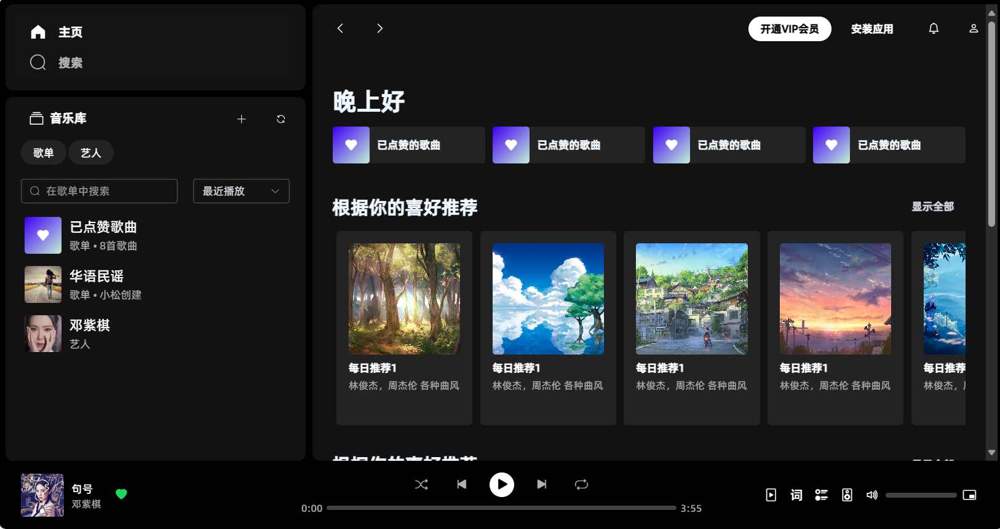
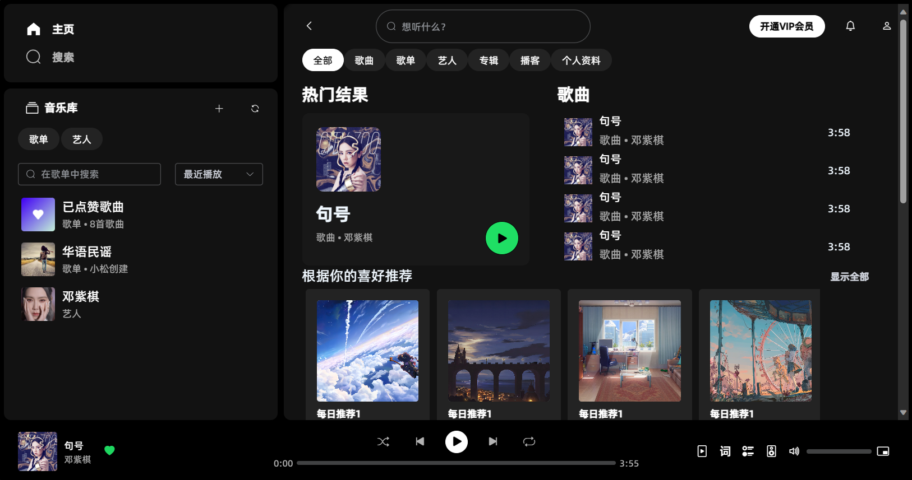
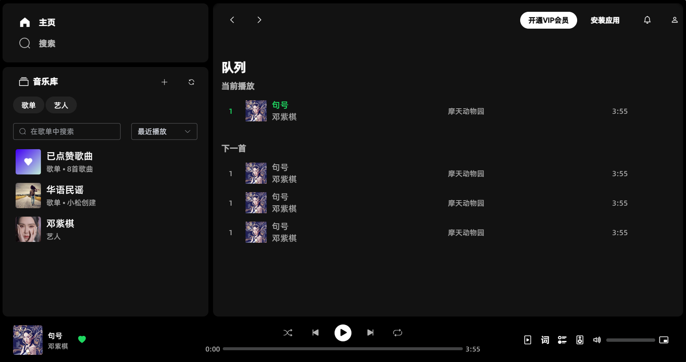
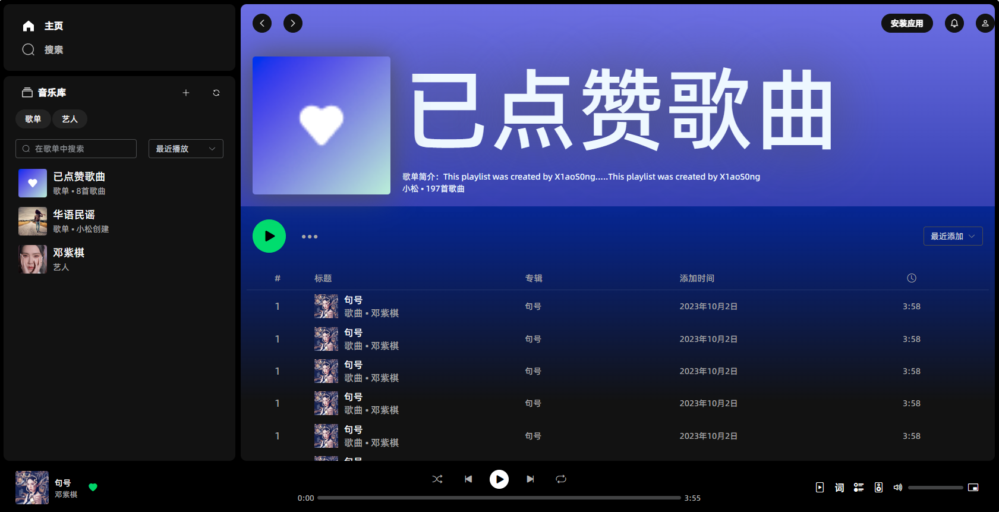
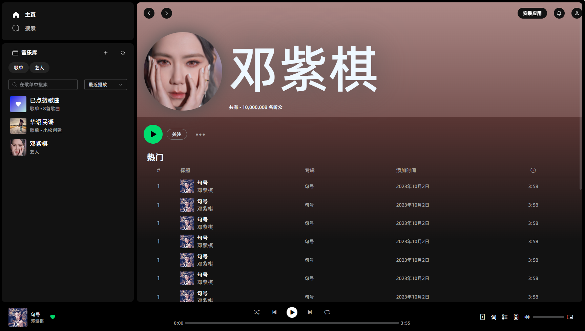
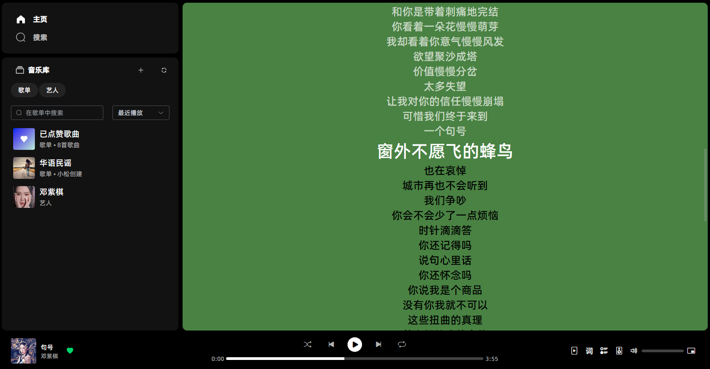
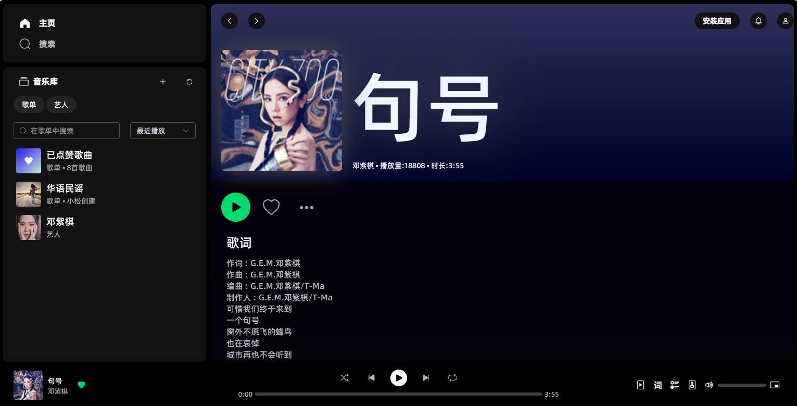
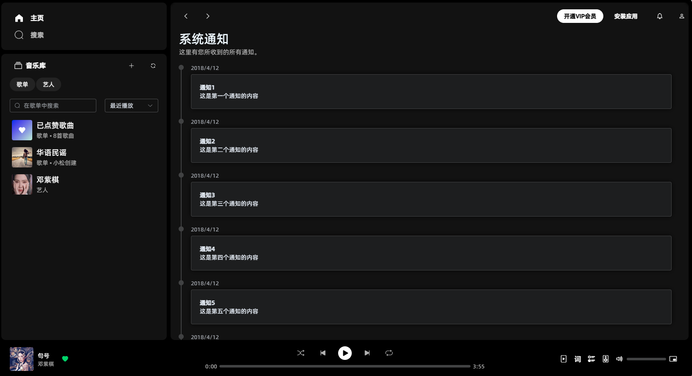

# music-website 🎵
  
基于vue仿spotify音乐网站 🌐  
该项目的后端程序：[基于Springboot仿spotify音乐网站后端程序](https://github.com/tzf1003/music-website-server)🔗  
目前，该项目正在开发中...🚧  

## 已开发界面预览 👀
### 主页 🏠

 

### 搜索页 🔍
 

### 播放列表 🎶
 

### 歌单 📝
 

### 艺人歌曲列表 🎤
 

### 歌词📖
 

### 歌曲详情🎧
 

### 系统通知
 
## 待开发 (Todo list) 📋
- ~~歌单 📝(已完成)~~
- ~~艺人歌曲列表 🎤(已完成)~~
- ~~歌词 📖(已完成)~~
- ~~歌曲详情 🎧~~
- ~~系统通知 (已完成)🔔~~
- 账号方面 👤
  - ~~账号注册界面 (已完成)📝~~
  - ~~账号登录界面 🔑(已完成)~~
  - 个人资料界面 🧑‍💼
  - 个人信息设置 ⚙️
- 后台管理 ⚙️
- AI功能(待定) 🤖
- 待补充... ➕

## 本地项目部署 🚀
### 克隆项目到本地 📥
```
git clone https://github.com/tzf1003/music-website.git
```

### 下载模块 ⬇️
```
npm install
```

### 运行 🏃‍♂️
```
npm run serve
```


